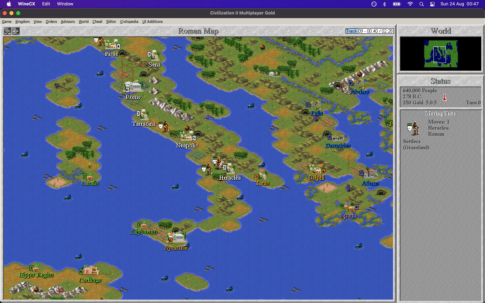

# How to run Civilization II on macOS in 2025

Civilization II was initially released in 1996 for Windows 3.1 and Windows 95, but it targeted the WinG/Win32s APIs. The Multiplayer Gold Edition from 1998 is a true Win32 application, and thus it can run using [Wine](https://www.winehq.org/). The objectives of this guide then:
- To run Civilization II Multiplayer Gold Edition
- Bug fixes and quality of life enhancements
- In-game music playback
- Videos for the High Council and for Wonders of the World
- All bundled game scenarios

## Game Installation
As with my [guide for SimCity 2000](https://github.com/patters-match/SC2KmacOS), we shall use [Porting Kit](https://www.portingkit.com/download). This offers an existing configuration for Civilization II, though its description does not make clear that this is in fact the Multiplayer Gold Edition. It mentions that it's a DOS game - also inaccurate since it targeted Windows 95.

This 'port' uses engine `WS11WineCX21.2.0` and will automatically download the game from the [bestoldgames.net](https://www.bestoldgames.net/) abandonware site. I'm not sure how it achieves this, since my own manual experiments were confounded by the game's InstallShield installer being a 16-bit executable, and not one that can be swapped out easily for a 32-bit version as with SimCity 2000.

This Porting Kit installation provides a working base game, however the in-game music, the videos, and the additional scenarios are all missing.

## Fixes and Enhancements
[Civilization 2 UI Additions](https://github.com/FoxAhead/Civ2-UI-Additions) is one-stop-shop of patches, fixes, and usability enhancements.
- In Porting Kit, navigate to Games > Installed.
- Hover over Custom Port named Civilization II, click on the gear wheel, Show in Finder.
- Right-click, Show package contents.
- Copy the Civ2UIA launcher and dll to `Contents/drive_c/Civilization 2`.
- Navigate back up to `Contents` and double-click `Wineskin`.
- Click Advanced, then amend 'Windows app' to the following, including the quotes:  
  `"C:\Civilization 2\Civ2UIALauncher.exe" -play -exe "C:\Civilization 2\civ2.exe" -dll "C:\Civilization 2\Civ2UIA.dll"`

## In-Game Music
The original game would play the in-game music tracks from the CD-ROM drive. The UI Additions hack allows music playback from files instead. The audio tracks can be extracted from a bin/cue image of the original disk:
- Use [Homebrew package manager](https://formulae.brew.sh/formula/bchunk) to install bchunk: `brew install bchunk`
- `bchunk -w ~/Downloads/Sid_Meier_s_Civilization_II_Multiplayer.bin ~/Downloads/Sid_Meier_s_Civilization_II_Multiplayer.cue track`
- This will result in `track01.iso` the CD-ROM data track, for the files, and WAV files `track02` to `track12` extracted with the required names.
- In Porting Kit, navigate to Games > Installed.
- Hover over Custom Port named Civilization II, click on the gear wheel, Show in Finder.
- Right-click, Show package contents.
- Create the folder `Contents/Contents/drive_c/Civilization 2/MUSIC`
- Copy the audio tracks into that folder.

## Videos
The next challenge is that the videos were not included in the bestoldgames.net download, and they are encoded in a very old Indeo 4 video codec. It should be trivial to add this codec via a winetrick script, but unfortunately this is outdated in the chosen engine and does not work.
- Right click on the track01.iso you created in the previous section, and select Open with > DiskImageMounter.
- From that mounted volume, open the Civ2 folder.
- Copy the `KINGS` and `VIDEOS` folders into the ported app's `Contents/drive_c/Civilization 2` folder.
- Eject the ISO image. It will prevent the in-game audio from working if it is mounted.
- Download Intel Indeo 5 Video codec [here](https://download.civforum.de/civ2/iv5setup.exe). There are various other installers for this on the Web, but many seem to have 16-bit setup loaders which will not work here, so use this one.
- 
