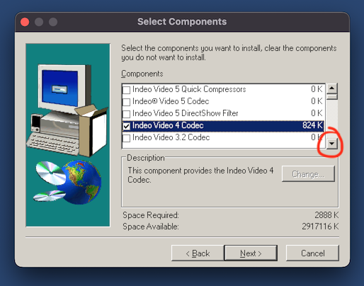

# How to run Civilization II on macOS in 2025


Civilization II was originally released in 1996 for Windows 3.1 and Windows 95, making use of the short-lived WinG graphics library.

The Multiplayer Gold Edition, released in 1998, was rewritten as a true Win32 application without this dependency. As a result, it doesn't require emulation and can run reliably using [Wine](https://www.winehq.org/), taking advantage of modern larger screen resolutions.

Objectives for this guide are:
- To run Civilization II Multiplayer Gold Edition
- Bug fixes and quality of life enhancements
- In-game music playback
- Videos for the High Council and for Wonders of the World
- All bundled game scenarios

## Game Installation
As with my [guide for SimCity 2000](https://github.com/patters-match/SC2KmacOS), we shall use [Porting Kit](https://www.portingkit.com/download). This offers an existing configuration for Civilization II, though its description does not make clear that this is in fact the Multiplayer Gold Edition. It also mentions that it's a DOS game which had led me to suspect it was a perhaps a DOSBox emulation of the original game release.

This 'port' uses engine `WS11WineCX21.2.0` and will automatically download the game from the [bestoldgames.net](https://www.bestoldgames.net/) abandonware site. I'm not sure how it achieves this, since my own manual install experiments were confounded by the game's installer being a 16-bit executable, and not one that can be swapped out easily for a 32-bit version as with SimCity 2000.

This Porting Kit installation provides a working base game, however the in-game music, the videos, and the additional scenarios are all missing.

## Fixes and Enhancements
[Civilization 2 UI Additions](https://github.com/FoxAhead/Civ2-UI-Additions) is one-stop-shop of patches, fixes, and usability enhancements. In particular it fixes the AI aggression bug with this specific version of the game.
- In Porting Kit, navigate to Games > Installed.
- Hover over Custom Port named Civilization II, click on the gear wheel, Show in Finder.
- Right-click, Show package contents.
- Copy the Civ2UIA launcher and dll to `Contents/drive_c/Civilization 2`.
- Navigate back up to `Contents` and double-click `Wineskin`.
- Click Advanced, then amend 'Windows app' to the following, including the quotes:  
  `"C:\Civilization 2\Civ2UIALauncher.exe" -play -exe "C:\Civilization 2\civ2.exe" -dll "C:\Civilization 2\Civ2UIA.dll"`

## In-Game Music
The original game would play the in-game music tracks from the CD-ROM drive. The UI Additions hack allows music playback from files instead. The audio tracks can be extracted from a bin/cue image of the original disk:
- Use [Homebrew package manager](https://formulae.brew.sh/formula/bchunk) to install bchunk: `brew install bchunk`
- `bchunk -w ~/Downloads/Sid_Meier_s_Civilization_II_Multiplayer.bin ~/Downloads/Sid_Meier_s_Civilization_II_Multiplayer.cue track`
- This will result in `track01.iso` the CD-ROM data track, for the files, and WAV files `track02` to `track12` extracted with the specific filenames which UI Additions is expecting. 
- In Porting Kit, navigate to Games > Installed.
- Hover over Custom Port named Civilization II, click on the gear wheel, Show in Finder.
- Right-click, Show package contents.
- Create the folder `Contents/drive_c/Civilization 2/MUSIC`
- Copy the audio tracks into that folder.

## Videos
The next challenge is that the videos were not included in the _bestoldgames.net_ download, and they are encoded using a very old Indeo 4 video codec. It should be trivial to add this codec via a 'winetrick', but unfortunately this helper script is outdated in the chosen engine and it does not work.
- Right click on the `track01.iso` you created in the previous section, and select Open with > DiskImageMounter.
- From that mounted volume, open the Civ2 folder.
- Copy the `KINGS` and `VIDEOS` folders into the ported app's `Contents/drive_c/Civilization 2` folder.
- Eject the ISO image. If it remains mounted it will prevent the in-game audio from working.
- Download Intel Indeo 5 Video codec [here](https://download.civforum.de/civ2/iv5setup.exe). There are various other installers for this on the Web, but many seem to have 16-bit setup loaders which will not work here, so use this one.
- Once again launch `Contents/Wineskin`.
- Click Install Software.
- Browse to `ivsetup.exe`.
- Select a Custom Install.
- Deselect all components except `Indeo Video 4 Codec`, noting that you will need to scroll down the list of components to do this. If you do not do this, the installer will get stuck searching for Netscape browser installations to add plugins to:  
  
- When the installation completes, a Windows Explorer window titled Indeo will open. Close this manually or else the installer process will continue to run.
- Wineskin will then warn that no new executables were detected. Ignore this.
- Cancel back to the main Wineskin screen.
- Click Tools > Command Line (cmd):  
  `reg import "C:\Civilization 2\Vfwfix.reg"`
- Close the cmd window.
- If you launch the app now you will see the intro video, confirming working playback.
- Start a new game then click the Game menu > Graphic Options > enable High Council and Wonder Movies.

## Scenarios
The _bestoldgames.net_ download which Porting Kit uses does not include the two official scenario packs bundled with Multiplayer Gold Edition: _Conflicts in Civilization_ and _Fantastic Worlds_. We cannot run the CD-ROM installer since it's a 16-bit executable, however we can extract them from the CD-ROM data:
- Mount `track01.iso` once again.
- Install unshield via Homebrew: `brew install unshield`
- ```
  cd ~/Downloads
  mkdir MGE
  cd MGE
  unshield x "/Volumes/Civ2:MGE v1.0/data1.cab"
  ```
- From `~/Downloads/MGE/Scenarios_-_English` copy the `SCENARIOS` folder to the app's `Contents/drive_c/Civilization 2` folder.
- As explained in `Contents/drive_c/Civilization 2/CIV2FANW.TXT` - do not move scenario files from their folder structure.
- Eject the mounted ISO image.

## Known Issues
- Some audio popping may occur, caused by the game's dated sound mixing routines and reliance on early DirectSound APIs in DirectX.

Enjoy! 🏛️

